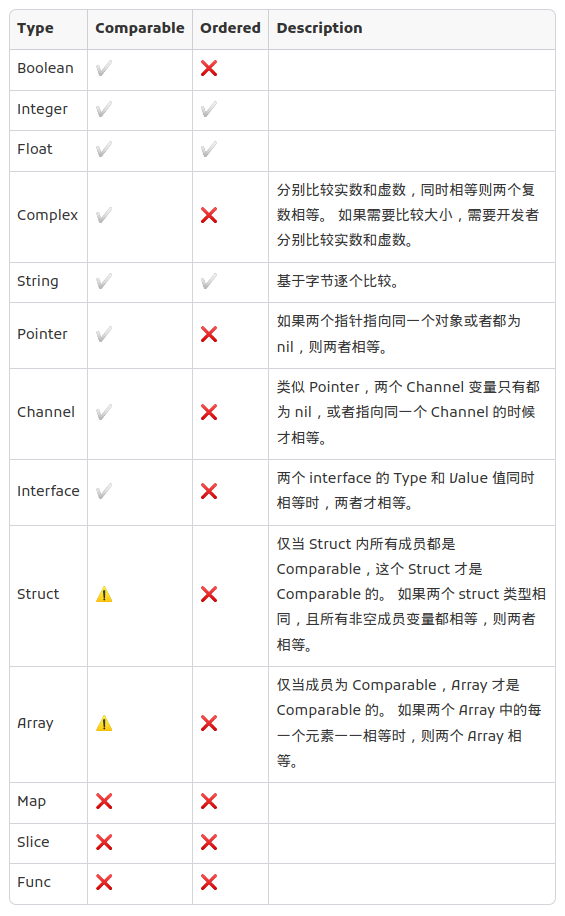

```go
package main

import (
	"errors"
	"fmt"
)

type MyError struct {
}

func (m MyError) Error() string {
	return "ErrorString"
}

var ErrBad = &MyError{}

func returnsError() error {
	var p *MyError = nil
	return p // Will always return a non-nil error.
}

type CustomError struct {
	Metadata map[string]string
	Message  string
}
type CustomErrorNoMap struct {
	Message string
}

func (c CustomErrorNoMap) Error() string {
	return c.Message
}

func (c CustomError) Error() string {
	return c.Message
}

var (
	ErrorA      = CustomError{Message: "A", Metadata: map[string]string{"Reason": ""}}
	ErrorB      = CustomError{Message: "B"}
	ErrorAPtr   = &CustomError{Message: "A", Metadata: map[string]string{"Reason": ""}}
	ErrorBPtr   = &CustomError{Message: "B"}
	ErrorANomap = CustomErrorNoMap{Message: "A"}
	ErrorBNomap = CustomError{Message: "B"}
)

func main() {
	fmt.Println(nil)
	fmt.Println(returnsError())
	fmt.Println(returnsError() == nil) //

	aNil, bNil := fmt.Sprint(nil), fmt.Sprint(returnsError())
	fmt.Println(aNil == bNil)

	aNilType, bNilType := fmt.Sprintf("%T", nil), fmt.Sprintf("%T", returnsError())
	fmt.Println(aNilType, bNilType)

	aNilValue, bNilValue := fmt.Sprintf("%v", nil), fmt.Sprintf("%v", returnsError())
	fmt.Println(aNilValue, bNilValue)

	var p *MyError = nil
	fmt.Println(p == nil)

	var interfaceMyerror error = p
	fmt.Println(interfaceMyerror == nil)

	//	============================================================

	fmt.Println(errors.Is(ErrorANomap, ErrorANomap))
	fmt.Println(errors.Is(ErrorA, ErrorA))
	fmt.Println(errors.Is(ErrorAPtr, ErrorAPtr))
}

```




```go
package main

import "fmt"

type Int interface {
	~int | ~uint
}

func IsSigned[T Int](n T) {
	switch (interface{})(n).(type) {
	case int:
		fmt.Println("signed")
	default:
		fmt.Println("unsigned")
	}
}

func main() {
	type MyInt int
	IsSigned(1)
	IsSigned(MyInt(1))
}

// Output:
// signed
// unsigned

```